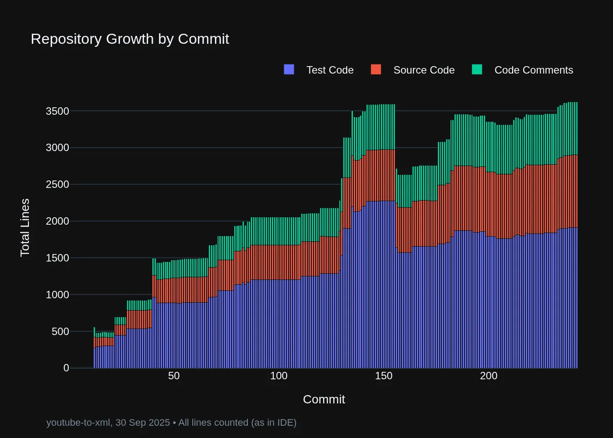

# 🎥 YouTube-to-XML

Convert YouTube transcripts to structured XML format with automatic chapter detection.

**Problem**: Raw YouTube transcripts are unstructured text that LLMs struggle to parse, degrading AI chat responses about video content.

**Solution**: Converts transcripts to XML with chapter elements for improved AI comprehension.


## 📦 Install

(1) First, install UV Python Package and Project Manager [from here](https://docs.astral.sh/uv/getting-started/installation/).

(2) Then, install `youtube-to-xml` accessible from anywhere in your terminal:

```bash
uv tool install git+https://github.com/michellepace/youtube-to-xml.git
```

## 🚀 Usage

The `youtube-to-xml` command intelligently auto-detects whether you're providing a YouTube URL or a transcript file.

### Option 1: URL Method (Easiest)

Convert directly from YouTube URL:

```bash
youtube-to-xml https://youtu.be/Q4gsvJvRjCU

🎬 Processing: https://www.youtube.com/watch?v=Q4gsvJvRjCU
✅ Created: how-claude-code-hooks-save-me-hours-daily.xml
```

Output XML (condensed - 4 chapters, 163 lines total):

```xml
<?xml version='1.0' encoding='utf-8'?>
<transcript video_title="How Claude Code Hooks Save Me HOURS Daily"
            video_published="2025-07-12"
            video_duration="2m 43s"
            video_url="https://www.youtube.com/watch?v=Q4gsvJvRjCU">
  <chapters>
    <chapter title="Intro" start_time="0:00">
      0:00
      Hooks are hands down one of the best
      0:02
      features in Claude Code and for some
      <!-- ... more transcript content ... -->
    </chapter>
    <chapter title="Hooks" start_time="0:19">
      0:20
      To create your first hook, use the hooks
      <!-- ... more transcript content ... -->
    </chapter>
    <!-- ... 2 more chapters ... -->
  </chapters>
</transcript>
```

> 📁 **[View Output XML →](example_transcripts/how-claude-code-hooks-save-me-hours-daily.xml)**

### Option 2: File Method

Manually copy YouTube transcript into a text file, then:

```bash
youtube-to-xml my_transcript.txt
# ✅ Created: my_transcript.xml
```

Copy-Paste Exact YT Format for `my_transcript.txt`:

```text
Introduction to Cows
0:02
Welcome to this talk about erm.. er
2:30
Let's start with the fundamentals
Washing the cow
15:45
First, we'll start with the patches
```

Output XML:

```xml
<?xml version='1.0' encoding='utf-8'?>
<transcript video_title="" video_published="" video_duration="" video_url="">
  <chapters>
    <chapter title="Introduction to Cows" start_time="0:02">
      0:02
      Welcome to this talk about erm.. er
      2:30
      Let's start with the fundamentals</chapter>
    <chapter title="Washing the cow" start_time="15:45">
      15:45
      First, we'll start with the patches</chapter>
  </chapters>
</transcript>
```

## 📊 Technical Details

- **Architecture**: Pure functions with clear module separation
- **Key Modules**: See [CLAUDE.md Key Modules section](CLAUDE.md#key-modules)
- **Dependencies**: Python 3.13+, `yt-dlp` for YouTube downloads, see [pyproject.toml](pyproject.toml)
- **Python Package Management**: [UV](https://docs.astral.sh/uv/concepts/projects/)
- **Test Driven Development**: 124 tests (19 slow, 105 unit, ~102 seconds)
- **Terminology**: Uses TRANSCRIPT terminology throughout codebase, see [docs/terminology.md](docs/terminology.md)

<div align="center">
  <a href="docs/terminology.md">
    
  </a>
  <p><em>YouTube transcript terminology throughout codebase: (click to read)</em></p>
</div>

## 🛠️ Development

🤖 *Repo 100% generated by Claude Code — every single line.*

Setup:

```bash
git clone https://github.com/michellepace/youtube-to-xml.git
cd youtube-to-xml
uv sync
```

Code Quality:

```bash
uv run ruff check --fix           # Lint and auto-fix (see pyproject.toml)
uv run ruff format                # Format code (see pyproject.toml)
```

Testing:

```bash
uv run pytest                     # All tests
uv run pytest -m "slow"           # Only slow tests (internet required)
uv run pytest -m "not slow"       # All tests except slow tests
uv run pre-commit run --all-files # (see .pre-commit-config.yaml)
```

<div align="center">
  <a href="docs/images/repo_evolution_commit.webp">
    
  </a>
  <p><em>Counted by my <a href="https://github.com/michellepace/plot-py-repo">plot-py-repo</a> tool</em></p>
</div>

## 🏗️ Architecture

```text
                    youtube-to-xml CLI
                           │
                    ┌──────┴───────┐
                    │  cli.py      │
                    │ (auto-detect)│
                    └──────┬───────┘
                           │
              ┌────────────┴────────────┐
              │                         │
        [URL Input]              [File Input]
              │                         │
      ┌───────▼────────┐       ┌────────▼────────┐
      │ url_parser.py  │       │ file_parser.py  │
      │                │       │                 │
      │ • yt-dlp API   │       │ • Pattern match │
      │ • JSON3 parse  │       │ • Chapter rules │
      │ • Metadata     │       │ • Empty metadata│
      └───────┬────────┘       └────────┬────────┘
              │                         │
              └────────────┬────────────┘
                           │
                    ┌──────▼──────┐
                    │  models.py  │
                    │             │
                    │TranscriptDoc│
                    │  Chapters   │
                    │  Metadata   │
                    └──────┬──────┘
                           │
                    ┌──────▼──────────┐
                    │ xml_builder.py  │
                    │                 │
                    │ • Format times  │
                    │ • Build XML tree│
                    └──────┬──────────┘
                           │
                      ┌────▼────┐
                      │ XML File│
                      └─────────┘
```

---

## 📕 *Personal Notes*

Evals To Do (transcript.txt vs transcript.xml):

- [ ] Build Shiny for Python app to use Hamel's [simple error analysis approach](https://hamel.dev/blog/posts/field-guide/index.html)
- [ ] But I don't like Hamel's binary approach, what about a Six Sigma ordinal data approach like in [docs/idea-evals.md](docs/idea-evals.md)?
- [ ] Automate the evals with pytest as far as possible, LLM as a Judge for others
- [ ] If XML is the winner, try tweak the XML structure to improve, for example [this](docs/knowledge/working-notes.md#better-format). Like whitespace, more tags, or maybe JSON?
- [ ] But now I've got a problem with cost because xml is in the context window. So can RAG perform equally as well and fast?
- [ ] Can use a cheaper model that performs equally as well, like Haiku over Sonnet (for some things)?
- [ ] At some point I'm going to have to head over to [BrainTrust.dev](https://www.braintrust.dev/) - use an agnostic SDK?

Learnings To Carry Over:

- [Use CodeRabbit for PR review](https://www.anthropic.com/customers/coderabbit) to improve code
- [Use Claude Code Docs](https://github.com/ericbuess/claude-code-docs) so Claude Code knows what it can do
- [Use Claude Code Project Index](https://github.com/ericbuess/claude-code-project-index) so Claude Code sees entire project easily
- [Manage MCPs nicely](docs/knowledge/manage-mcps-nicely.md) constrain what you use, put API keys in one place
- [Git branch workflow](docs/knowledge/git-branch-flow.md) try put everything on a purposeful branch
- Always use strict linting and typing and enforce in [pre-commit hook](.pre-commit-config.yaml)
- Always do test-driven development and [manual LLM testing](docs/refactor-todo/exceptions/test_url.md) is useful too
- Manage LLM Context: set [terminology](docs/terminology.md), use clear naming, keep docstrings/comments accurate, at 60% context window `/clear` Claude Code

Open Questions:

- Q1. Is there something I could have done better with UV?
- Q2. Is the system architecture well-designed and elegant?
- Q3. Is the exception design suitable for a future API service?
- Q4. Are [tests/](tests/) clear and sane, or over-engineered?
- Q5. Was it safe to exclude "XML security" Ruff [S314](pyproject.toml)?
