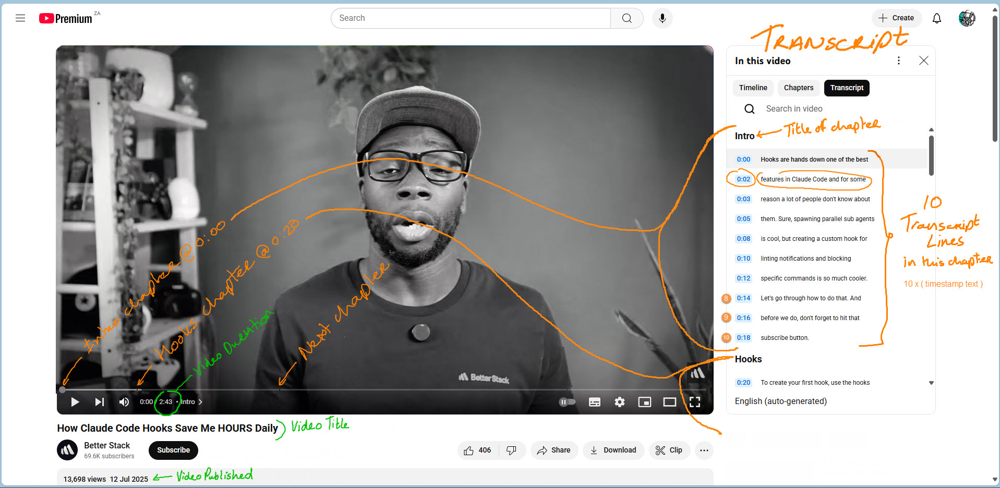
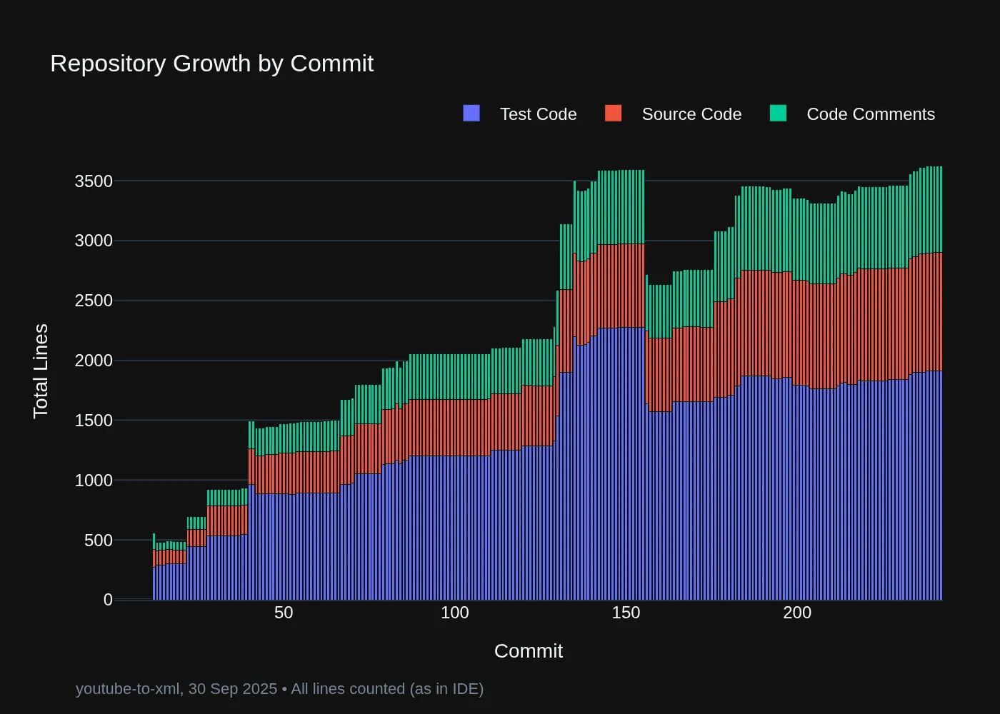

# 🎥 YouTube-to-XML

Convert YouTube transcripts to structured XML format with automatic chapter detection.

**Problem**: Raw YouTube transcripts are unstructured text that LLMs struggle to parse, degrading AI chat responses about video content.

**Solution**: Converts transcripts to XML with chapter elements for improved AI comprehension.


## 📦 Install

(1) First, install UV Python Package and Project Manager [from here](https://docs.astral.sh/uv/getting-started/installation/).

(2) Then, install `youtube-to-xml` accessible from anywhere in your terminal:

```bash
uv tool install git+https://github.com/michellepace/youtube-to-xml.git
```

## 🚀 Usage

The `youtube-to-xml` command intelligently auto-detects whether you're providing a YouTube URL or a transcript file.

### Option 1: URL Method (Easiest)

Convert directly from YouTube URL:

```bash
youtube-to-xml https://youtu.be/Q4gsvJvRjCU

🎬 Processing: https://www.youtube.com/watch?v=Q4gsvJvRjCU
✅ Created: how-claude-code-hooks-save-me-hours-daily.xml
```

Output XML (condensed - 4 chapters, 88 lines total):

```xml
<?xml version='1.0' encoding='utf-8'?>
<transcript video_title="How Claude Code Hooks Save Me HOURS Daily"
            video_published="2025-07-12"
            video_duration="2m 43s"
            video_url="https://www.youtube.com/watch?v=Q4gsvJvRjCU">
  <chapters>
    <chapter title="Intro" start_time="0:00">
      0:00 Hooks are hands down one of the best
      0:02 features in Claude Code and for some
      <!-- ... more transcript content ... -->
    </chapter>
    <chapter title="Hooks" start_time="0:19">
      0:20 To create your first hook, use the hooks
      <!-- ... more transcript content ... -->
    </chapter>
    <!-- ... 2 more chapters ... -->
  </chapters>
</transcript>
```

> 📁 **[View Output XML →](example_transcripts/how-claude-code-hooks-save-me-hours-daily.xml)**

### Option 2: File Method

Manually copy YouTube transcript into a text file, then:

```bash
youtube-to-xml my_transcript.txt
# ✅ Created: my_transcript.xml
```

Copy-Paste Exact YT Format for `my_transcript.txt`:

```text
Introduction to Cows
0:02
Welcome to this talk about erm.. er
2:30
Let's start with the fundamentals
Washing the cow
15:45
First, we'll start with the patches
```

Output XML:

```xml
<?xml version='1.0' encoding='utf-8'?>
<transcript video_title="" video_published="" video_duration="" video_url="">
  <chapters>
    <chapter title="Introduction to Cows" start_time="0:02">
      0:02 Welcome to this talk about erm.. er
      2:30 Let's start with the fundamentals
    </chapter>
    <chapter title="Washing the cow" start_time="15:45">
      15:45 First, we'll start with the patches
    </chapter>
  </chapters>
</transcript>
```

## 🤖 Demo: Claude Code Analysis

See **[demo-analysing-transcripts-with-claude-code.md](docs/demo-analysing-transcripts-with-claude-code.md)** for a real conversation where Claude Code analyses a 2-hour video transcript.

Interesting findings:

- **63,231 tokens** — too large for Claude Code to read at once, but it adapted by using grep and reading specific line ranges
- **XML chapters** — made it trivial to target specific sections (e.g., "analyse chapter 10 and 11")
- **Follow-up questions** — improved answer completeness. In an App this could be handled by prompt engineering.

Claude Code can only read 25,000 tokens at a time. But the Anthropic API has a 200,000 token window. So, we still don't have to use RAG (later).

## 📊 Technical Details

- **Architecture**: Pure functions with clear module separation
- **Key Modules**: See [CLAUDE.md](.claude/CLAUDE.md)
- **Dependencies**: Python 3.14+, `yt-dlp` for YouTube downloads, see [pyproject.toml](pyproject.toml)
- **Python Package Management**: [UV](https://docs.astral.sh/uv/concepts/projects/)
- **Test-Driven Development**: 125 tests (19 slow, 106 unit)
- **Terminology**: Uses TRANSCRIPT terminology throughout codebase, see [docs/terminology.md](docs/terminology.md)

<div align="center">
  <a href="docs/terminology.md">
    
  </a>
  <p><em>YouTube transcript terminology throughout codebase: (click to read)</em></p>
</div>

## 🛠️ Development

🤖 *Repo 100% generated by Claude Code — every single line.*

Setup:

```bash
git clone https://github.com/michellepace/youtube-to-xml.git
cd youtube-to-xml
uv sync
```

Code Quality:

```bash
uv run ruff check --fix           # Lint and auto-fix (see pyproject.toml)
uv run ruff format                # Format code (see pyproject.toml)
```

Testing:

```bash
uv run pytest                     # All tests
uv run pytest -m "slow"           # Only slow tests (internet required)
uv run pytest -m "not slow"       # All tests except slow tests
uv run pre-commit run --all-files # (see .pre-commit-config.yaml)
```

<div align="center">
  <a href="docs/images/repo_evolution_commit.webp">
    
  </a>
  <p><em>Counted by my <a href="https://github.com/michellepace/plot-py-repo">plot-py-repo</a> tool</em></p>
</div>

## 🏗️ Architecture

```text
                    youtube-to-xml CLI
                           │
                    ┌──────┴───────┐
                    │  cli.py      │
                    │ (auto-detect)│
                    └──────┬───────┘
                           │
              ┌────────────┴────────────┐
              │                         │
        [URL Input]              [File Input]
              │                         │
      ┌───────▼────────┐       ┌────────▼────────┐
      │ url_parser.py  │       │ file_parser.py  │
      │                │       │                 │
      │ • yt-dlp API   │       │ • Pattern match │
      │ • JSON3 parse  │       │ • Chapter rules │
      │ • Metadata     │       │ • Empty metadata│
      └───────┬────────┘       └────────┬────────┘
              │                         │
              └────────────┬────────────┘
                           │
                    ┌──────▼──────┐
                    │  models.py  │
                    │             │
                    │TranscriptDoc│
                    │  Chapters   │
                    │  Metadata   │
                    └──────┬──────┘
                           │
                    ┌──────▼──────────┐
                    │ xml_builder.py  │
                    │                 │
                    │ • Format times  │
                    │ • Build XML tree│
                    └──────┬──────────┘
                           │
                      ┌────▼────┐
                      │ XML File│
                      └─────────┘
```

---

## Appendix 1: Decision - Inline Transcript Timestamps

Each transcript line now places the timestamp and text on the **same line**, rather than on separate lines:

**Before (separate lines)**

```text
0:02
Welcome to this talk about cows
2:30
Let's start with the fundamentals
15:45
First, we'll start with the patches
```

**After (same line)**

```text
0:02 Welcome to this talk about cows
2:30 Let's start with the fundamentals
15:45 First, we'll start with the patches
```

**Why?** The primary consumer of these transcripts is an LLM agent (e.g. Claude Code) that navigates large files by searching for keywords and reading line ranges. With inline timestamps, every search hit is a self-contained record — the agent immediately knows *what* was said and *when*, in a single operation. No follow-up read to find the timestamp on the line above.

<div align="center">
  <a href="docs/images/inline-timestamps.svg">
    
  </a>
  <p><em>Searching a transcript with thousands of lines: separate lines require a second lookup for the timestamp, same-line format returns a complete record</em></p>
</div>

---

## 📕 Appendix 2: *Personal Notes*

Evals To Do (transcript.txt vs transcript.xml):

- [ ] Build Shiny for Python app to use Hamel's [simple error analysis approach](https://hamel.dev/blog/posts/field-guide/index.html)
- [ ] But I don't like Hamel's binary approach, what about a Six Sigma ordinal data approach like in [docs/idea-evals.md](docs/idea-evals.md)?
- [ ] Automate the evals with pytest as far as possible, LLM as a Judge for others
- [ ] If XML is the winner, try tweak the XML structure to improve, for example [this](docs/knowledge/working-notes.md#better-format). Like whitespace, more tags, or maybe JSON?
- [ ] But now I've got a problem with cost because xml is in the context window. So can RAG perform equally as well and fast?
- [ ] Can use a cheaper model that performs equally as well, like Haiku over Sonnet (for some things)?
- [ ] At some point I'm going to have to head over to [BrainTrust.dev](https://www.braintrust.dev/) - use an agnostic SDK?

Learnings To Carry Over:

- [Use CodeRabbit for PR review](https://www.anthropic.com/customers/coderabbit) to improve code
- [Use Claude Code Docs](https://github.com/ericbuess/claude-code-docs) so Claude Code knows what it can do
- [Use Claude Code Project Index](https://github.com/ericbuess/claude-code-project-index) so Claude Code sees entire project easily
- [Manage MCPs nicely](docs/knowledge/manage-mcps-nicely.md) constrain what you use, put API keys in one place
- [Git branch workflow](docs/knowledge/git-branch-flow.md) try put everything on a purposeful branch
- Always use strict linting and typing and enforce in [pre-commit hook](.pre-commit-config.yaml)
- Always do test-driven development and [manual LLM testing](docs/refactor-todo/exceptions/test_url.md) is useful too
- Manage LLM Context: set [terminology](docs/terminology.md), use clear naming, keep docstrings/comments accurate, at 60% context window `/clear` Claude Code

Open Questions:

- Q1. Is there something I could have done better with UV?
- Q2. Is the system architecture well-designed and elegant?
- Q3. Is the exception design suitable for a future API service?
- Q4. Are [tests/](tests/) clear and sane, or over-engineered?
- Q5. Was it safe to exclude "XML security" Ruff [S314](pyproject.toml)?
