# 🎯 SPEC — YouTube Transcript to XML Converter

**A UV Packaged Application with CLI entry point** that converts YouTube transcript text files into structured XML format with chapter elements.

## User Context

**Problem**: Raw YouTube transcripts are difficult for LLMs to parse effectively due to lack of structure degrading AI Chat responses.

**Solution**: Convert transcripts to XML with chapter elements for improved AI comprehension.

**Primary Users**: 
- Students following 5 hours+ YouTube tutorials
- Researchers analysing video content

## Project Architecture

**UV Project Type**: UV Packaged Application (created with `uv init --package youtube-to-xml`)

**Key Features of Packaged Structure**:
- Professional Structure: `src/` layout with proper module organisation
- Build System: `[build-system]` for distribution in `pyproject.toml`
- Entry Point: `[project.scripts]` configuration in `pyproject.toml`
- Usage: `youtube-to-xml transcript.txt` and `youtube-to-xml --help`

**Entry Point Flow**: CLI command `youtube-to-xml` → `main()` in `cli.py` → orchestrates file_parser, xml_builder, and exceptions modules following "one module, one purpose"

**URL Flow (experimental)**: CLI command `url-to-transcript` → `url_to_transcript_wrapper.main()` → `scripts/url_to_transcript.py` → fetch metadata/subtitles → `parse_transcript_api()` → XML

### Architecture & Data Flow

```mermaid
---
config:
  theme: dark
---
flowchart TD
    subgraph TOP[" "]
        direction LR
        
        CLI["`**🙂 User Command**
        youtube-to-xml transcript.txt`"]

        CLIMOD["`**cli.py**
        • Parse args
        • File I/O operations
        • Error handling
        • Orchestration`"]

        OUTPUT["`**transcript.xml**
        (output file in current directory)`"]

        CLI --> CLIMOD
        CLIMOD --> OUTPUT
    end
    
    EXCEPTIONS["`**exceptions.py**
    • BaseTranscriptError
    • FileEmptyError
    • FileInvalidFormatError`"]
    
    PARSER["`**file_parser.py**
    • Validate format
    • Find chapters
    • Extract content`"]
    
    XMLBUILDER["`**xml_builder.py**
    • Generate XML
    • Handle escaping`"]
    
    CLIMOD --> |Raw text<br>as string| PARSER
    PARSER --> |"List[Chapter]<br>(frozen dataclass)"| XMLBUILDER
    XMLBUILDER --> |XML string| CLIMOD
    EXCEPTIONS -.-> PARSER
    EXCEPTIONS -.-> CLIMOD
    
    style CLI color:#fff,fill:#3874ac
    style OUTPUT color:#fff,fill:#419f52
```



## Design Principles

**TDD-Driven Design**: Write tests first - this naturally creates:
- Pure, testable functions (no side effects in business logic)
- Clear module boundaries (easier to mock dependencies)
- Single responsibility (complex functions are hard to test)

**Key Guidelines**:
- Separate layers: CLI → business logic → I/O
- Pure functions preferred: Core logic functions should be easy to test without setup
- Handle errors at boundaries: Catch exceptions in CLI layer, not business logic
- One module, one purpose: Each `.py` file has a clear role
- Type hints required: All function signatures need type annotations
- Descriptive naming: Functions/variables should clearly indicate purpose

**TDD Guidelines `pytest`**
- Use pytest's `tmp_path` fixture to avoid creating test files
- Avoid mocks as they introduce unnecessary complexity
- Test incrementally: One test should drive one behavior
- Use focused test names that describe what's being tested  

## Python Tech Stack

**Language:** Python 3.13+ (as pinned in `.python-version`)

**Approach:** Test-Driven Development (TDD)

**Required Libraries:**
- `argparse` (command-line arguments and `--help`)
- `pathlib` (file operations)
- `re` (regex pattern matching)
- `xml.etree.ElementTree` (XML parsing/validation)
- `pytest` (test driven development)
- `subprocess` (CLI integration testing)

## Example: Raw Transcript → XML Format

Valid raw YouTube transcript files start with one line of text (not a timestamp) and have one or more chapters as shown in `<transcript_raw>` tags. For this `<transcript_raw>` example, the required XML output is shown in `<transcript_processed>`.

<transcript_raw>
Introduction
0:00
Welcome to today's session
2:28
Let's dive into the topic
15:45
First point about methodology
23:30
Second point here
Getting Started Guide  
1:15:30
Download the software
2:45:12
Configure it , erm, how "you" like it
Advanced Features & Tips
10:15:30
Final thoughts on implementation
</transcript_raw>

<transcript_processed>
```xml
<transcript video_title="" upload_date="" duration="" video_url="">
  <chapters>
    <chapter title="Introduction" start_time="0:00">
      0:00
      Welcome to today's session
      2:28
      Let's dive into the topic
      15:45
      First point about methodology
      23:30
      Second point here
    </chapter>
    <chapter title="Getting Started Guide" start_time="1:15:30">
      1:15:30
      Download the software
      2:45:12
      Configure it , erm, how &quot;you&quot; like it
    </chapter>
    <chapter title="Advanced Features &amp; Tips" start_time="10:15:30">
      10:15:30
      Final thoughts on implementation
    </chapter>
  </chapters>
</transcript>
```
</transcript_processed>

## Detection Rules

- **Timestamp Pattern**: Lines containing only timestamp formats (M:SS, MM:SS, H:MM:SS, HH:MM:SS, or HHH:MM:SS)
- **First Chapter**: First line of text file
- **Subsequent Chapters**: When exactly 2 lines exist between consecutive timestamps, the second line (non-timestamp) is a chapter title


## XML Generation Rules and Required Template

- **Use ElementTree API**: Build XML with `ET.Element()`, `ET.SubElement()`, `.set()` for attributes, assign content with `.text`, and format with `ET.indent()`
- **XML Serialisation**: Use `ET.ElementTree(root).write()` or `ET.tostring()` + file write for XML output with proper encoding and declaration
- **Parse Requirement**: Must parse successfully using `xml.etree.ElementTree.parse()`
- **Template Compliance**: Must exactly follow XML template shown between `<xml_template>` tags

<xml_template>
```xml
<transcript video_title="" upload_date="" duration="" video_url="">
  <chapters>
    <chapter title="chapter 1 title" start_time="[start timestamp]">
      Content first chapter... (timestamps AND non-timestamp lines with proper indentation)
    </chapter>
    <chapter title="chapter 2 title" start_time="[start timestamp]">
      Content second chapter... (timestamps AND non-timestamp lines with proper indentation)
    </chapter>

    <!-- Additional chapters as needed -->
  </chapters>
</transcript>
```
</xml_template>

## File I/O Requirements

- **Execution**: CLI command `youtube-to-xml filename.txt`
- **Input**: Text file containing YouTube transcript in the specified format
- **Output**: XML file matches input filename and is saved to current directory. Example: `filename99.txt` → `filename99.xml`
- **Success Message**: `f"✅ Created: {output_path}"` when conversion completes successfully
- **Argparse `--help`**: the help message in between `<argparse_help>` tags is shown

<argparse_help>

```text
usage: youtube-to-xml [-h] transcript.txt

Convert YouTube transcripts to XML format with chapter detection

positional arguments:
  transcript.txt  YouTube transcript text file to convert

options:
  -h, --help      show this help message and exit

✅ Example YouTube Transcript

📋 EXPECTED FORMAT:
   ┌─────────────────────────────────────────
   │ Introduction to Bret Taylor
   │ 00:04
   │ You're CTO of Meta and and co-CEO of...
   └─────────────────────────────────────────

🔧 REQUIREMENTS:
   - 1st line: (non-timestamp) → becomes first chapter
   - 2nd line: (timestamp e.g. "0:03") → becomes start_time for first chapter
   - 3rd line: (non-timestamp) → first content line of first chapter

💡 Check that your transcript follows this basic pattern
```
</argparse_help>

## Error Handling & Validation

**Exception Architecture**: Custom exception types in `exceptions.py` module, all inheriting from `BaseTranscriptError`:
- `FileEmptyError`: "Cannot parse an empty transcript file"
- `FileInvalidFormatError`: "Transcript file must start with a chapter title, not a timestamp"

**CLI Error Messages**: Parser raises specific exceptions, CLI catches and formats user-friendly messages:
- File not found: `f"❌ We couldn't find your file: {filename}"`
- Permission denied: `f"❌ We don't have permission to access: {filename}"`
- Empty file: `f"❌ Your file is empty: {filename}"`
- Invalid format: `f"❌ Wrong format in '{filename}' - run 'youtube-to-xml --help'"`
- Write permission: `f"❌ Cannot write to: {output_path}"`

**Input Validation Requirements**: 
- Refer to REQUIREMENTS section in `<argparse_help>` for format specification
- File must not be empty
- Must have at least 3 non-empty lines: chapter title, timestamp, and content
- First line must be a chapter title (not a timestamp)
- Second line must be a timestamp
- Third line must be content (not a timestamp)

## Success Criteria

- [x] Produces exact XML output format matching the provided template `<xml_template>`
- [x] Correctly identifies chapter titles vs content including all edge cases
- [x] Generates valid XML that parses successfully with `xml.etree.ElementTree.parse()`
- [x] Validates input files and provides clear error messages for invalid formats
- [x] Implements complete CLI with proper argparse help and file operations
- [x] Custom exception architecture separating business logic from user presentation
- [x] Test driven development used resulting in coverage and good design (avoid mocks)
- [x] Clean project structure following Python best practices
- [x] Performance handles transcripts up to 15,000 lines in less than 2 seconds

---

## Key References

**Python Documentation**
- ElementTree XML API: https://docs.python.org/3/library/xml.etree.elementtree.html
- Pytest `tmp_path` fixture: https://docs.pytest.org/en/stable/how-to/tmp_path.html

**UV Package Manager**
- UV Workflows and Rules: `.cursor.rules/uv-workflows.mdc`
- Project Layout: https://docs.astral.sh/uv/concepts/projects/layout/
- Packaged Applications: https://docs.astral.sh/uv/concepts/projects/packaging/
