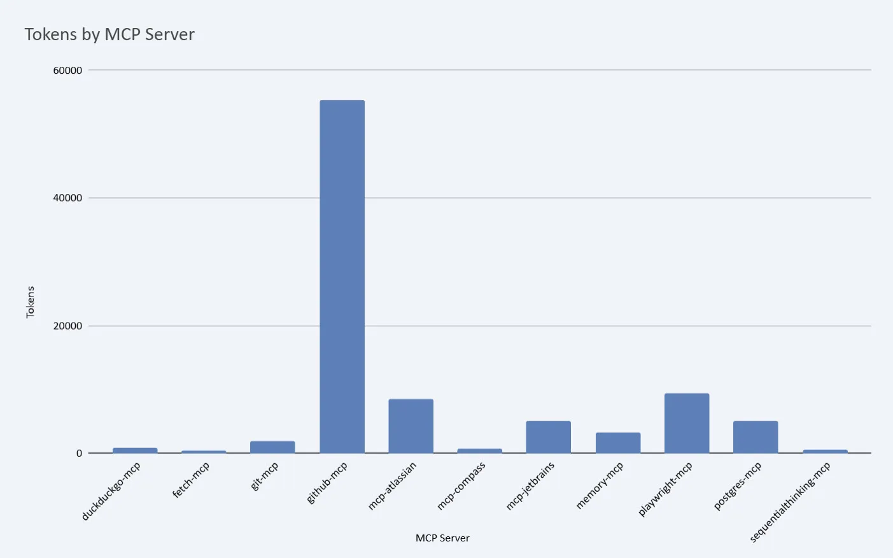

# Managing MCPs Nicely — Scope, Example, Commands

**VERIFIED** against official Anthropic documentation (Sep 4, 2025):
- https://docs.anthropic.com/en/docs/claude-code/mcp
- https://docs.anthropic.com/en/docs/claude-code/settings

There are three MCP installation scopes to choose from. I use "Project Scope" for my solo projects as I like the MCP config in source control. Some MCPs, like https://ref.tools/mcp, need an API Key. This guide shows one simple way to "keep your API keys in one place" (and never in source control).

---

## MCP Installation Scopes

| Scope | Command (with flag) | Where's the config? | Use Case |
|:------|:----------|:--------|:---------|
| 🛖 **Local Scope**<br/>_Private to you in a **specific project**_ | `claude mcp add --scope local` | Outside project<br/>*`~/.claude.json` (not in source control)* | MCPs for a specific project, you don't care about keeping config in source control. Default scope. |
| ♥️ **Project Scope**<br/>*Shared with team via source control* | `claude mcp add --scope project` | Inside project directory<br/> *`.mcp.json` (checked into source control)* | Team-shared MCPs that everyone can access OR its your project and you want config source control. |
| 🔛 **User Scope**<br/>_Private to you across **all projects**_ | `claude mcp add --scope user` | Outside project<br/>*`~/.claude.json` (not in source control)* | MCPs available to all projects, you don't care about keeping config in source control. |

_**Key Notes**_
- _**All Scopes Active**: MCPs from all three scopes (local + project + user) are available simultaneously in your project._
- _**Precedence: Local (strongest) ➜ Project ➜ User**: When the same MCP is added, local overrides project, project overrides user._
- _**Security**: Project-scoped servers from `.mcp.json` require approval before use for security_
- _**Source control**: Only `.mcp.json` (project scope) should be checked into source control_
- _**Project scope tip**: Run a new `claude` once you've added at project scope to approve_ 
- _**Reset**: Use `claude mcp reset-project-choices` to reset project-scoped server approval choices_

🛖♥️🔛

---

## 🍑 Example: Add Ref MCP with an API Key

To install [https://ref.tools/mcp](https://ref.tools/mcp) if you followed the instructions it would hardcode your API key and default to local scope, `claude mcp add --transport http Ref "https://api.ref.tools/mcp?apiKey=YOUR_API_KEY"`

### Step 1 — Put Your MCP API Keys In "one place"

1. Check your shell type: `echo $SHELL` (to determine if to use .zshrc or .bashrc)
2. Open shell settings (e.g., `cursor ~/.zshrc` or `cursor ~/.bashrc` for bash).
3. Append this to the file that opens:
   ```text
   # ⭐ MCP API keys "One Place"
   export API_KEY_MCP_REF="ref-4b23455555gat343434c"
   export API_KEY_MCP_ANOTHER="another-key"
   ```
4. Refresh your shell `source ~/.zshrc`
5. Verify the variable is set `echo $API_KEY_MCP_REF`.

⭐ Ensure you replace "ref-4b23455555gat343434c" above with your own Ref API key

### Step 2 — Add Ref MCP for all scopes

_Adding to "all scopes" as a learning exercise, otherwise choose your preferred._

```bash
# Use this exactly (keep "API_KEY_MCP_REF" )
claude mcp add --scope local --transport http Ref 'https://api.ref.tools/mcp?apiKey=${API_KEY_MCP_REF}'
claude mcp add --scope project --transport http Ref 'https://api.ref.tools/mcp?apiKey=${API_KEY_MCP_REF}'
claude mcp add --scope user --transport http Ref 'https://api.ref.tools/mcp?apiKey=${API_KEY_MCP_REF}'
```

Now check the config files shown in the table - you'll see your API key isn't hardcoded in any of them. That's super. It means you can safely check `mcp.json` into source control. And you can easily change your API key in only one place if you need to.

### Step 3 — See how precedence works

Local (strongest) → Project → User:

1. Accessible MCPs: `claude mcp list`
2. Verify Ref at Local scope: `claude mcp get Ref`
3. Remove Ref from Local scope: `claude mcp remove Ref --scope local`
4. Verify Ref now at Project scope: `claude mcp get Ref`
5. Remove Ref from Project scope: `claude mcp remove Ref --scope project`
6. Verify Ref now at User scope: `claude mcp get Ref`
7. Remove Ref from User scope: `claude mcp remove Ref --scope user`
8. Add Ref again at your preferred scope(s)
9. Open Claude Code `claude` → see your MCP(s) `/mcp`

I add my MCPs at Project Scope as it is visible in the project root and goes into source control. I avoid other scopes as they are additive. That is, if you configure MCP xyz at, say, Local Scope, it will be available in your project too, but not explicit. See Key Note under table (item 1).

## 🍑 Example: Add FireCrawl MCP with an API Key

To add [https://www.firecrawl.dev](https://www.firecrawl.dev/) at project scope:

```bash
# Add API key as variable
echo 'export API_KEY_MCP_FIRECRAWL="fc-0646dd97d66a555db02ccb0000000000"' >> ~/.zshrc

# Check you set the key
source ~/.zshrc && echo $API_KEY_MCP_FIRECRAWL

# Install firecrawl
claude mcp add --scope project firecrawl -e FIRECRAWL_API_KEY='${API_KEY_MCP_FIRECRAWL}' -- npx -y firecrawl-mcp

# Start a new claude and check your MCPs
claude  # then run "/mcp" to see your available MCPs
```

## 🔥 Limit your MCPs

Read [https://ghuntley.com/allocations/](https://ghuntley.com/allocations/) and run claude `/context` as to why you should consider limiting the MCPs you set up.

<a href="https://ghuntley.com/allocations/">
   
</a>

In short - manage your context, limit the MCPs you add to just what you really need.