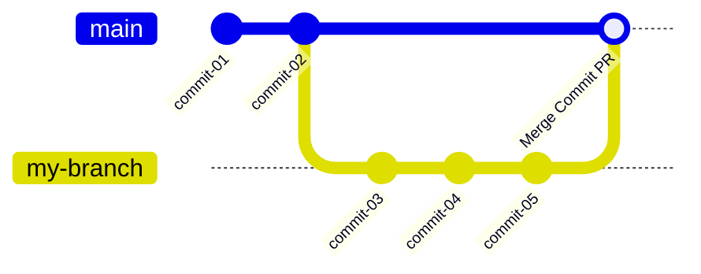
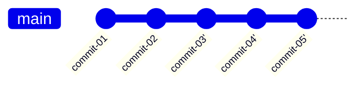
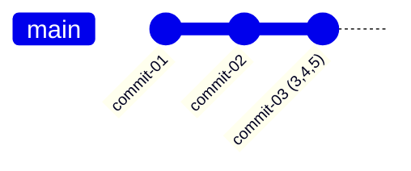

# Git Branch Workflow

You can keep it simple and commit to main always, or you can use branches, or you can do both. This is about working with branches where you will need to do a "pull request" (PR), review and then approve it. When you approve, you need to choose how to "merge" the branch back into main (which is in fact a branch itself).

> [!TIP]
> ***Why "pull request"?*** *You're requesting that repo maintainers "pull" your changes from your branch into main. GitLab calls them "merge requests" which is more accurate.*
> 
> ***Use CodeRabbit*** 🐰 *To make PR reviews more fun and automatically detect problems missed, signup to https://coderabbit.ai and connect your repo. It's free for public repos. It creates a lovely visual diagram of the PR. It writes a poem.*

## As Commands

```bash
git checkout main && git pull origin main   # Start on main
git checkout -b my-branch                   # Create branch
git add .                                  # Do commits
git commit -m "Commit message"             # Do commits
git push origin my-branch                  # Push to remote
# Do Pull Request in GitHub UI
# Create PR: select my-branch -> main
# Review changes in PR
# Approve and merge choices: ⭐commit, ✅rebase, 🏳️squash
git checkout main && git pull origin main   # Sync local main
git branch --delete my-branch              # Delete branch (step 1)
git push origin --delete my-branch         # Delete branch (step 2)
# Ready for next branch: repeat from 'Create branch'
```

## As a Picture


## The Three PR Merge Types

**The story:** done two commits to main. Then I created a branch and did three commits in that and submitted a pull-request. Now in GitHub, Joe goes to approve the PR. He has to choose how to merge it back into main. Depending on what he chooses, this is what the git history will look like:

**Merge Commit**: you see the commits AND +1 commit for the branch. You can see this visually represented so it's easy for to back track on "collections of things" (ie branches of commits)



**Merge Rebase:** branch commits are rebased into main resulting in a linear history.



**Merge Squash:** branch commits are squashed into "one" and rebased into main, resulting in a short linear history.



**Popular:** Merge commit is the most popular and mostly always used for teams. Merge Rebase gives a nice uncomplicated history, often suited to solo developers.  But Merge Commit helps to “undo collections of things" more easily assuming its standalone. That is, undo all the branch's changes at once.

## GitHub UI for project

**Creating a Pull Request**
- After `git push origin my-branch`, GitHub often shows a green "Compare & pull request" banner at the top of your repo - click it
- Or go to "Pull requests" tab → "New pull request" button
- Select: base branch (`main`) ← compare branch (`my-branch`) 
- Add title, description, then "Create pull request"

**Finding Your PRs**
- **"Pull requests" tab** shows all PRs for the project
- **Filter by your PRs**: Click "Author" dropdown → select your username
- **PR Status indicators**: 🟢 Open (awaiting review/merge). 🟣 Merged (completed). 🔴 Closed (rejected/cancelled)
- Click any PR to see its details, commits, and discussion

**Viewing Git History**
- The "**Commits**" tab shows the history as depicted in your diagrams
- The "**Pull requests**" tab lets you revisit PRs to see grouped commits, especially useful for merge commits
- The "**Insights**" → "Network" graph visualises branch merges (most relevant for merge commit)

---

## 🌿 Branch Strategy for YouTube Transcript to XML Converter

*(Generated by claude.ai)*

**Note**: Project foundation (UV package structure, pyproject.toml) already committed to main ✅

| **Branch Name** | **Scope** | **Key Deliverables** | **Duration** |
|-----------------|-----------|---------------------|--------------|
| `feature/parser` | Complete parser module | TDD implementation: timestamp detection, validation, chapter identification, content extraction, edge cases | 🟡 Medium |
| `feature/xml-builder` | XML generation module | ElementTree XML building, escaping, template compliance | 🟡 Medium |
| `feature/file-handler` | File I/O operations | Read/write functions, directory creation, path handling | 🟢 Quick |
| `feature/cli-interface` | Main CLI module | Argparse, error boundaries, orchestration, --help message | 🟡 Medium |
| `integration/end-to-end` | Full pipeline testing | CLI integration tests, large file performance, edge cases | 🟡 Medium |
| `polish/final-touches` | Documentation & cleanup | README, final validation, code review fixes | 🟢 Quick |

Much cleaner! The `feature/parser` branch will contain all the TDD work (tests 1-8 from your plan) in one cohesive unit, making it perfect for mobile development with `@claude` since the entire parser scope is clear and contained. 📱

---