# Git Branch Workflow

Working with branches, pull requests and which merge option to choose.

## The Elephant Branch and "pull request" into the Zoo

When you commit code into Git, it's always to a "branch". The default branch is "main", so if you don't know about branches, you've always been committing to main. Run `git status` and you'll see it.

Think of a branch as a "group of commits for a specific feature or task", you get to pick how to group things. Let's say you have a "zoo" project, and now you're building an elephant. You could do the "add the tail" and "add the legs" commits to main, OR, you could make an "elephant branch". Do all your commits in there, and when done "send the elephant branch to GitHub" by creating a "pull request". 

A pull request is just "I built this elephant branch and I've sent it to GitHub, I'm REQUESTING you to PULL it into the main branch (the proper zoo)." 

I code solo, so once I've sent a pull request to GitHub, I go to GitHub and approve it. In the real world, someone else would review the code and approve it. It's generally not the same person. 

By the time I've created my pull request on GitHub, I'm really quite sick of code. So I don't want to review it. I use the free CodeRabbit to review my PR in GitHub. It picks up a surprising amount of things. I'm lazy to fix these things, I used to paste the suggestions back into my IDE but now I just get Claude Code to run `gh api repos/michellepace/youtube-to-xml/pulls/1/reviews` (my username, my repo, my pull number 1 - obviously the URL changes). Claude then sees all the issues CodeRabbit found and fixes them for me. Then I push the fixes to the branch (which updates the existing PR), and approve the PR from GitHub, which means it's now in the main branch. 

The great thing about branches is you might make a royal mess of the elephant. It's much easier to remove the elephant from the zoo later, because the commits are all collected together.

## In Short

You can keep it simple and commit to main always, or you can use branches, or you can do both. I do both: I commit to main when I'm setting up the project, then I start to use branches for functionality.

This is about working with branches where you will need to create a pull request (from your machine), review, and then approve it (from GitHub). When you approve, you need to choose how to "merge" the branch back into main (main is actually the default branch).

> [!TIP]
> ***Why "pull request"?*** *You're requesting that repo maintainers "pull" your changes from your branch into main. GitLab calls them "merge requests" which is more accurate.*
> 
> ***Use CodeRabbit*** 🐰 *To make PR reviews more fun and catch missed issues automatically, sign up at https://coderabbit.ai and connect your repo. Free for public repos, with a lovely PR diagram—and even a poem.*

## As Commands

```bash
git checkout main && git pull origin main  # Start on main branch
git checkout -b my-branch                  # Create a branch
git add .                                  # Add files you want to commit
git commit # Make your commit (or "Claude Code: review changes and write commit msg")
git push origin my-branch                  # Push to remote (i.e., GitHub)

# Do Pull Request in GitHub UI
# Create PR: select my-branch -> main
# Review changes in PR
# Approve and merge options: ⭐commit, ✅rebase, 🏳️squash

git checkout main && git pull origin main  # Sync local main
git branch --delete my-branch              # Delete branch (step 1)
git push origin --delete my-branch         # Delete branch (step 2)
# Ready for next feature branch
```

## As a Picture

```mermaid
---
title: Git Branch Workflow
config:
  look: neo
  layout: dagre
  theme: redux-dark
  htmlLabels: false
---
flowchart TD
    START(["`**Start on main**
    git checkout main
    git pull origin main`"]) --> CREATE["`**Create branch**
    git checkout -b my-branch`"]
    CREATE --> WORK["`**Do commits**
    git add .
     git commit`"]
    WORK --> PUSH["`**Push to remote**
    git push origin my-branch`"]
    PUSH --> PR["`**Create Pull Request**
    GitHub: New PR, select
    my-branch -> main`"]
    PR --> REVIEW["`**Code review**
    GitHub: Review
    changes in PR`"]
    REVIEW --> APPROVE["`**Approve & merge PR**
    *GitHub Choices:*
    a)Merge commit →⭐visual
    b)Rebase merge →✅clean
    c)Squash merge →v.sparse`"]
    APPROVE --> SYNC["`**Sync local main**
    git checkout main
    git pull origin main`"]
    SYNC --> CLEANUP["`**Delete branch (2 steps)**
    git branch --delete my-branch
    git push origin --delete my-branch`"]
    CLEANUP --> NEXT["`**Ready for next branch**`"]
    NEXT -.-> |Create next branch| CREATE
```



## The Three PR Merge Types

**The story:** done two commits to main. Then I created a branch and did three commits in that and submitted a pull-request. Now in GitHub, Joe goes to approve the PR. He has to choose how to merge it back into main. Depending on what he chooses, this is what the git history will look like:

**Merge Commit**: you see the commits AND +1 commit for the branch. You can see this visually represented so it's easy for to back track on "collections of things" (ie branches of commits)


**Merge Rebase:** branch commits are rebased into main resulting in a linear history.


**Merge Squash:** branch commits are squashed into "one" and rebased into main, resulting in a short linear history.


**Popular:** Merge commit is the most popular and mostly always used for teams. Merge Rebase gives a nice uncomplicated history, often suited to solo developers.  But Merge Commit helps to “undo collections of things" more easily assuming its standalone. That is, undo all the branch's changes at once.

## GitHub UI for project

**Creating a Pull Request**
- After `git push origin my-branch`, GitHub often shows a green "Compare & pull request" banner at the top of your repo - click it
- Or go to "Pull requests" tab → "New pull request" button
- Select: base branch (`main`) ← compare branch (`my-branch`) 
- Add title, description, then "Create pull request"

**Finding Your PRs**
- **"Pull requests" tab** shows all PRs for the project
- **Filter by your PRs**: Click "Author" dropdown → select your username
- **PR Status indicators**: 🟢 Open (awaiting review/merge). 🟣 Merged (completed). 🔴 Closed (rejected/cancelled)
- Click any PR to see its details, commits, and discussion

**Viewing Git History**
- The "**Commits**" tab shows the history as depicted in your diagrams
- The "**Pull requests**" tab lets you revisit PRs to see grouped commits, especially useful for merge commits
- The "**Insights**" → "Network" graph visualises branch merges (most relevant for merge commit)

## Claude Code is fabulous at Git / GitHub

Claude Code is fantastic at working with Git. I get it to handle all things Git for me—generating commit messages, undoing a commit, creating PRs, etc.

Go to the Anthropic docs and ask the chat there: 
- Can Claude Code help me with git if I install `gh`?
- Can Claude Code create a PR for me, what does this mean?
- What can I do with `@claude` in GitHub, is this something else?

Code Rabbit uses Anthropic https://www.anthropic.com/customers/coderabbit 🙂

---

## 🌿 Branch Strategy for YouTube Transcript to XML Converter

*(Generated by claude.ai for this little project)*

**Note**: Project foundation (UV package structure, pyproject.toml) already committed to main ✅

| **Branch Name** | **Scope** | **Key Deliverables** | **Duration** |
|-----------------|-----------|---------------------|--------------|
| `feature/parser` | Complete parser module | TDD implementation: timestamp detection, validation, chapter identification, content extraction, edge cases | 🟡 Medium |
| `feature/xml-builder` | XML generation module | ElementTree XML building, escaping, template compliance | 🟡 Medium |
| `feature/file-handler` | File I/O operations | Read/write functions, directory creation, path handling | 🟢 Quick |
| `feature/cli-interface` | Main CLI module | Argparse, error boundaries, orchestration, --help message | 🟡 Medium |
| `integration/end-to-end` | Full pipeline testing | CLI integration tests, large file performance, edge cases | 🟡 Medium |
| `polish/final-touches` | Documentation & cleanup | README, final validation, code review fixes | 🟢 Quick |

Much cleaner! The `feature/parser` branch will contain all the TDD work (tests 1-8 from your plan) in one cohesive unit, making it perfect for mobile development with `@claude` since the entire parser scope is clear and contained. 📱

---
