# YouTube Transcript to XML Converter - Implementation Plan

## 🏗️ Architecture Overview

### Four Modules (src/youtube_to_xml/)

1. **`main.py`** - CLI entry point, argument parsing, error handling
2. **`parser.py`** - Transcript parsing and validation logic (pure functions)
3. **`xml_builder.py`** - XML generation from parsed data (pure functions)
4. **`file_handler.py`** - All file I/O operations

### Data Flow

```mermaid
---
config:
  theme: redux
---
flowchart TD
    CLI["`**User Command**
    youtube-to-xml
    transcript.txt`"]
    MAIN["`**main.py**
    • Parse args
    • Orchestrate
    • Handle errors`"]
    FILEREAD["`**file_handler.py**
    read_file()`"]
    PARSER["`**parser.py**
    • Validate format
    • Find chapters
    • Extract content`"]
    XMLBUILDER["`**xml_builder.py**
    • Generate XML
    • Handle escaping`"]
    FILEWRITE["`**file_handler.py**
    write_file()`"]
    OUTPUT["`**transcript_files/**
    └── transcript.xml
    (output file)`"]
    CLI --> MAIN
    MAIN --> FILEREAD
    FILEREAD --> |Raw text<br>as string| PARSER
    PARSER --> |"List[Chapter]<br>(frozen dataclass)"| XMLBUILDER
    XMLBUILDER --> |XML string| FILEWRITE
    FILEWRITE --> OUTPUT

    style CLI color:#fff,fill:#3874ac,stroke:#000,stroke-dasharray: 5 5
    style OUTPUT color:#fff,fill:#419f52,stroke:#000,stroke-dasharray: 5 5
```



## 🎯 First Deliverable: parser.py

### Data Structure

```python
from dataclasses import dataclass
from typing import List

@dataclass(frozen=True, slots=True)
class Chapter:
    """Chapter with all data needed for XML generation."""
    line_idx: int            # Line number where chapter title appears
    name: str                # Chapter title
    start_timestamp: str     # Start time (e.g., "0:00")
    content: List[str]       # All transcript lines in this chapter
```

### Core Function

```python
def parse_transcript(text: str) -> List[Chapter]:
    """Parse transcript text and return list of chapters with content.
    
    Raises:
        ValueError: If transcript is empty, starts with timestamp, 
                   or contains no timestamps
    """
    # 1. Validate format (first line must not be timestamp)
    # 2. Find all timestamps using regex
    # 3. Identify chapters (first line + 2-line rule)
    # 4. Extract content for each chapter
    # Returns: List of Chapter objects with complete data
```

### Reference Implementation

The chapter detection algorithm is proven in `scripts/transcript_reporter.py`. We extend it by:
- Adding content extraction (partitioning lines between chapters)
- Using clearer field names (`name` instead of `text`)
- Including validation with proper error messages
- Handling the crash vulnerability (empty timestamp list)

## 🧪 TDD Test Sequence

Tests ordered to incrementally drive implementation, following TDD principle of "one test, one behavior":

### 1. **`test_timestamp_pattern_matching()`**
   - Verify regex matches: M:SS, MM:SS, H:MM:SS, HH:MM:SS
   - Test non-matches (text lines, invalid formats)
   - **Drives**: Timestamp detection foundation

### 2. **`test_find_timestamps_in_text()`**
   - Find all timestamp line indices in multi-line text
   - Returns list of indices where timestamps appear
   - **Drives**: Timestamp location functionality

### 3. **`test_validate_transcript_format()`**
   - First line must not be a timestamp
   - At least one timestamp must exist
   - Empty transcript should raise ValueError
   - **Drives**: Input validation with clear errors

### 4. **`test_identify_first_chapter()`**
   - First non-timestamp line is always a chapter
   - Verify correct name and timestamp extraction
   - **Drives**: First chapter rule implementation

### 5. **`test_detect_chapter_boundaries()`**
   - When exactly 2 lines between timestamps, line before second timestamp is new chapter
   - Find all chapter transitions
   - **Drives**: Two-line rule implementation

### 6a. **`test_extract_content_single_chapter()`**
   - Simplest case: transcript with only ONE chapter
   - Example: "Intro\n0:00\nLine 1\nLine 2"
   - **Drives**: Basic content extraction when no next chapter exists

### 6b. **`test_extract_content_first_chapter()`**
   - First chapter when multiple exist
   - Stops before next chapter's line_idx
   - **Drives**: Finding end boundary for first chapter

### 6c. **`test_extract_content_middle_chapter()`**
   - Middle chapter between two others
   - Has both start and end boundaries
   - **Drives**: Content extraction with both boundaries

### 6d. **`test_extract_content_last_chapter()`**
   - Last chapter includes all remaining lines to EOF
   - **Drives**: Special case handling for final chapter

### 7. **`test_parse_simple_transcript()`**
   - End-to-end with 2-chapter transcript
   - Verify complete parsing pipeline
   - **Drives**: Integration of all components

### 8. **`test_parse_edge_cases()`**
   - Empty text, no timestamps, starts with timestamp
   - Special characters in chapter names (&, ", <, >)
   - Multi-hour timestamps (10:15:30)
   - **Drives**: Robustness and error handling

## 🔍 Manual Verification

### 1. Interactive Python Testing
```bash
# Start REPL and test interactively
uv run python

# Then past this in
from youtube_to_xml.parser import parse_transcript
sample = """Introduction
0:00
Welcome to the session
2:30
Let's begin
Chapter Two
5:00
New content here"""
chapters = parse_transcript(sample)
print(f'📚 Total chapters: {len(chapters)}\n')
max_width = max(len(ch.name) for ch in chapters)
for ch in chapters:
  print(f'{ch.start_timestamp:>8} - {ch.name:<{max_width}} {len(ch.content):>5}')
```

### 2. Compare with Reference Script
```bash
# Reference script shows detected chapters only
uv run python scripts/transcript_reporter.py transcript.txt

# Our parser extracts chapters WITH content
uv run python -c "
from youtube_to_xml.parser import parse_transcript
from pathlib import Path
text = Path('transcript.txt').read_text()
chapters = parse_transcript(text)
print(f'📚 Total chapters: {len(chapters)}\n')
max_width = max(len(ch.name) for ch in chapters)
for ch in chapters:
    print(f'{ch.start_timestamp:>8} - {ch.name:<{max_width}} {len(ch.content):>5}')
"
```

### 3. Edge Case Testing
```bash
# Create test files using heredoc (universal syntax)
cat > minimal.txt << 'EOF'
Chapter One
0:00
Content
EOF

cat > long_timestamp.txt << 'EOF'
Long Chapter
10:15:30
Content
EOF

cat > special_chars.txt << 'EOF'
Special & "Chars"
0:00
Content
EOF

# Test each one
for file in *.txt; do
    echo "Testing $file:"
    uv run python -c "
from youtube_to_xml.parser import parse_transcript
text = open('$file').read()
try:
    chapters = parse_transcript(text)
    print(f'  ✓ Parsed {len(chapters)} chapters')
except ValueError as e:
    print(f'  ✗ Validation error: {e}')
"
done
```

### 4. Performance Testing
```bash
# Generate 15,000 line test file
uv run python -c "
for i in range(150):
    if i == 0:
        print('Introduction')
    print(f'{i}:00')
    print(f'Content line {i}')
    if i > 0 and i % 10 == 0:
        print(f'Chapter {i//10}')
" > large_transcript.txt

# Time the parsing (should be < 2 seconds)
time uv run python -c "
from youtube_to_xml.parser import parse_transcript
text = open('large_transcript.txt').read()
chapters = parse_transcript(text)
print(f'✓ Parsed {len(chapters)} chapters from 15,000 lines')
"
```

## ✅ Design Principles (per SPEC.md)

- **Pure Functions**: Parser and XML builder have no side effects
- **Single Responsibility**: Each module has one clear purpose
- **Type Hints**: All functions fully typed
- **Error Boundaries**: Only main.py catches exceptions
- **Testable**: Core logic isolated from I/O
- **TDD-Driven**: Small, focused tests that incrementally build functionality

## 🎨 Architecture Notes

### Why This Design Works
- **Simple**: Only 4 modules, clear responsibilities
- **Proven**: Builds on working `transcript_reporter.py` logic
- **Testable**: Pure functions for 50% of codebase
- **Maintainable**: Clean module boundaries
- **Safe**: Proper validation prevents crashes

### Content Extraction Algorithm
```python
# For each identified chapter:
if is_last_chapter:
    # Include all lines from timestamp to EOF
    content = lines[chapter_timestamp_idx:]
else:
    # Include lines from timestamp until next chapter
    next_chapter_line_idx = chapters[i + 1].line_idx
    content = lines[chapter_timestamp_idx:next_chapter_line_idx]
```

### Potential Future Improvements
- Streaming for files >100MB (current design loads into memory)
- Configuration file for constants (currently embedded in modules)

## 📝 Implementation Order

1. Write 11 tests for `parser.py` (tests 1-5, 6a-6d, 7-8)
2. Implement parser functions incrementally to pass each test
3. Create `xml_builder.py` with tests
4. Add `file_handler.py` for I/O
5. Wire together in `main.py`

---

**Key Point**: Start with `parser.py` using TDD. The reference script provides the chapter detection algorithm - extend it with content extraction and proper validation.