# YouTube Transcript to XML Converter - Implementation Plan

## 🏗️ Architecture Overview

### Four Modules (src/youtube_to_xml/)

1. **`main.py`** - CLI entry point, argument parsing, error handling
2. **`parser.py`** - Transcript parsing and validation logic (pure functions)
3. **`xml_builder.py`** - XML generation from parsed data (pure functions)
4. **`file_handler.py`** - All file I/O operations

### Data Flow

```mermaid
---
config:
  theme: redux
---
flowchart TD
    CLI["`**User Command**
    youtube-to-xml
    transcript.txt`"]
    MAIN["`**main.py**
    • Parse args
    • Orchestrate
    • Handle errors`"]
    FILEREAD["`**file_handler.py**
    read_file()`"]
    PARSER["`**parser.py**
    • Validate format
    • Find chapters
    • Extract content`"]
    XMLBUILDER["`**xml_builder.py**
    • Generate XML
    • Handle escaping`"]
    FILEWRITE["`**file_handler.py**
    write_file()`"]
    OUTPUT["`**transcript_files/**
    └── transcript.xml
    (output file)`"]
    CLI --> MAIN
    MAIN --> FILEREAD
    FILEREAD --> |Raw text<br>as string| PARSER
    PARSER --> |"List[Chapter]<br>(frozen dataclass)"| XMLBUILDER
    XMLBUILDER --> |XML string| FILEWRITE
    FILEWRITE --> OUTPUT

    style CLI color:#fff,fill:#3874ac,stroke:#000,stroke-dasharray: 5 5
    style OUTPUT color:#fff,fill:#419f52,stroke:#000,stroke-dasharray: 5 5
```



## 🎯 First Deliverable: parser.py

### Data Structure

```python
from dataclasses import dataclass
from typing import List

@dataclass(frozen=True, slots=True)
class Chapter:
    """Chapter with all data needed for XML generation."""
    title: str               # Chapter title
    start_time: str          # Start time (e.g., "0:00")
    content_lines: List[str] # All transcript lines in this chapter
```

### Core Function

```python
def parse_transcript(text: str) -> List[Chapter]:
    """Parse transcript text and return list of chapters with content.
    
    Raises:
        ValueError: If transcript is empty, starts with timestamp, 
                   or contains no timestamps
    """
    # 1. Validate format (first line must not be timestamp)
    # 2. Find all timestamps using regex
    # 3. Identify chapters (first line + 2-line rule)
    # 4. Extract content for each chapter
    # Returns: List of Chapter objects with complete data
```

## 🧪 Implemented Test Suite (differs from orig. version)

The test suite uses modern pytest patterns with fixtures and parametrization for comprehensive coverage. Tests are organized by functional area rather than strict TDD sequence, providing superior maintainability and edge case coverage.

### **Timestamp Foundation Tests**
- **`test_valid_timestamps[]`** (parametrized) - Verify regex matches all valid formats (M:SS, MM:SS, H:MM:SS, HH:MM:SS)
- **`test_invalid_timestamps[]`** (parametrized) - Reject invalid patterns and text lines
- **`test_find_timestamps_in_text()`** - Find all timestamp line indices in multi-line text

### **Input Validation Tests**
- **`test_validate_valid_transcript()`** - Valid transcript passes validation
- **`test_validate_invalid_transcripts[]`** (parametrized) - Empty files, missing timestamps, wrong format

### **Chapter Detection Tests**
- **`test_first_chapter_detection()`** - First non-timestamp line becomes a chapter
- **`test_subsequent_chapter_detection()`** - Chapter detected when exactly 2 lines between timestamps
- **`test_no_chapter_when_wrong_gap[]`** (parametrized) - No detection with 1-line or 3-line gaps
- **`test_multiple_chapters()`** - Multiple chapters detected with correct sequencing

### **Content Extraction Tests**
- **`test_single_chapter_content()`** - Single chapter includes all content to EOF
- **`test_chapter_content_ranges()`** - Multiple chapters have correct content boundaries
- **`test_chapter_with_many_timestamps()`** - Chapter content includes multiple timestamps within

### **Integration & Realistic Scenarios**
- **`test_complete_parsing()`** - End-to-end with realistic multi-chapter transcript
- **`test_special_characters()`** - Special characters in titles (&, ", <, >) handled correctly
- **`test_empty_lines_preserved()`** - Empty lines maintained in content
- **`test_consecutive_timestamps()`** - Multiple consecutive timestamps handled properly

### **Error Handling Tests**
- **`test_error_conditions[]`** (parametrized) - Comprehensive error scenarios with proper exception messages

## 🔍 Manual Verification

### 1. Interactive Python Testing
```bash
# Start REPL and test interactively
uv run python

# Then past this in
from youtube_to_xml.parser import parse_transcript
sample = """Introduction
0:00
Welcome to the session
2:30
Let's begin
Chapter Two
5:00
New content here"""
chapters = parse_transcript(sample)
print(f'📚 Total chapters: {len(chapters)}\n')
max_width = max(len(ch.title) for ch in chapters)
for ch in chapters:
  print(f'{ch.start_time:>8} - {ch.title:<{max_width}} {len(ch.content_lines):>5}')
```

### 2. Compare with Reference Script
```bash
# Reference script shows detected chapters only
uv run python scripts/transcript_reporter.py transcript.txt

# Our parser extracts chapters WITH content
uv run python -c "
from youtube_to_xml.parser import parse_transcript
from pathlib import Path
text = Path('transcript.txt').read_text()
chapters = parse_transcript(text)
print(f'📚 Total chapters: {len(chapters)}\n')
max_width = max(len(ch.title) for ch in chapters)
for ch in chapters:
    print(f'{ch.start_time:>8} - {ch.title:<{max_width}} {len(ch.content_lines):>5}')
"
```

### 3. Edge Case Testing
```bash
# Create test files using heredoc (universal syntax)
cat > minimal.txt << 'EOF'
Chapter One
0:00
Content
EOF

cat > long_timestamp.txt << 'EOF'
Long Chapter
10:15:30
Content
EOF

cat > special_chars.txt << 'EOF'
Special & "Chars"
0:00
Content
EOF

# Test each one
for file in *.txt; do
    echo "Testing $file:"
    uv run python -c "
from youtube_to_xml.parser import parse_transcript
text = open('$file').read()
try:
    chapters = parse_transcript(text)
    print(f'  ✓ Parsed {len(chapters)} chapters')
except ValueError as e:
    print(f'  ✗ Validation error: {e}')
"
done
```

### 4. Performance Testing
```bash
# Generate 15,000 line test file
uv run python -c "
for i in range(150):
    if i == 0:
        print('Introduction')
    print(f'{i}:00')
    print(f'Content line {i}')
    if i > 0 and i % 10 == 0:
        print(f'Chapter {i//10}')
" > large_transcript.txt

# Time the parsing (should be < 2 seconds)
time uv run python -c "
from youtube_to_xml.parser import parse_transcript
text = open('large_transcript.txt').read()
chapters = parse_transcript(text)
print(f'✓ Parsed {len(chapters)} chapters from 15,000 lines')
"
```

## ✅ Design Principles (per SPEC.md)

- **Pure Functions**: Parser and XML builder have no side effects
- **Single Responsibility**: Each module has one clear purpose
- **Type Hints**: All functions fully typed
- **Error Boundaries**: Only main.py catches exceptions
- **Testable**: Core logic isolated from I/O
- **TDD-Driven**: Small, focused tests that incrementally build functionality

## 🎨 Architecture Notes

### Why This Design Works
- **Simple**: Only 4 modules, clear responsibilities
- **Proven**: Builds on working `transcript_reporter.py` logic
- **Testable**: Pure functions for 50% of codebase
- **Maintainable**: Clean module boundaries
- **Safe**: Proper validation prevents crashes

### Content Extraction Algorithm
```python
# For each identified chapter:
if is_last_chapter:
    # Include all lines from timestamp to EOF
    content = lines[chapter_timestamp_idx:]
else:
    # Include lines from timestamp until next chapter
    next_chapter_title_idx = chapters[i + 1].title_index
    content = lines[chapter_timestamp_idx:next_chapter_title_idx]
```

### Potential Future Improvements
- Streaming for files >100MB (current design loads into memory)
- Configuration file for constants (currently embedded in modules)

## 📝 Implementation Status

1. 🟡 **`parser.py`** - Includes 30 tests (exceeds original 11 planned tests), additional refactoring needed. But good for now.
2. 🔲 **`xml_builder.py`** - Not yet implemented
3. 🔲 **`file_handler.py`** - Not yet implemented  
4. 🔲 **`main.py`** - Not yet implemented

---

**Key Point**: The `parser.py` implementation is complete and exceeds the original TDD plan. It includes comprehensive chapter detection, content extraction, and robust validation with modern test patterns.