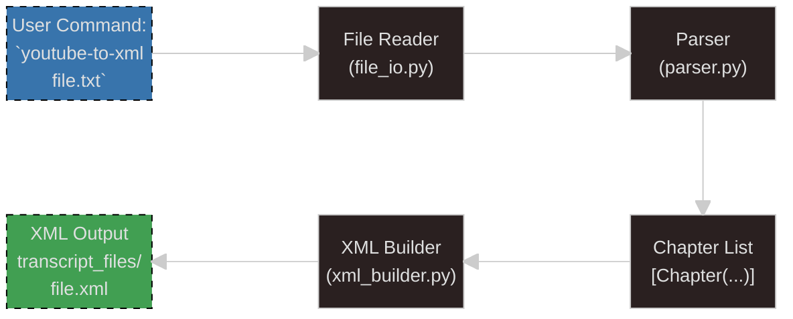

# 🎯 YouTube Transcript to XML Converter - First Deliverable Plan

## Solution Architecture Preview 🏗️

Based on SPEC.md analysis, here's the **'one module, one purpose'** design:

### Module Structure

**📄 `src/youtube_to_xml/parser.py`** - Pure parsing logic
- Contains the core Chapter detection algorithm (extends existing `scripts/transcript_reporter.py`)  
- Handles transcript line analysis and timestamp pattern matching
- Returns structured Chapter objects with content - this is pure business logic, no I/O
- Easily testable with simple string inputs and structured outputs

**📄 `src/youtube_to_xml/xml_builder.py`** - XML generation engine
- Takes parsed Chapter objects and converts them to XML using ElementTree
- Implements the exact template format required by SPEC.md
- Handles proper XML escaping and indentation
- Pure function: Chapters in → XML string out

**📄 `src/youtube_to_xml/file_io.py`** - File operations boundary
- Handles reading transcript files and writing XML files  
- Creates `transcript_files/` directory if needed
- Manages file naming conventions (input.txt → transcript_files/input.xml)
- Contains all file system error handling

**📄 `src/youtube_to_xml/cli.py`** - Command-line interface
- Argparse setup with the exact help message from SPEC.md
- Orchestrates the pipeline: file_io → parser → xml_builder → file_io
- Error boundary - catches exceptions and provides user-friendly messages
- Validation of file format requirements

**📄 `src/youtube_to_xml/__init__.py`** - Entry point
- Simple main() function that calls cli.main()
- Keeps the package interface clean

### 🌊 Flow Diagram


## First Deliverable Scope 🎯

**Which module first?** `parser.py` - Here's why:

1. **Core Business Logic** - This is where the actual transcript-to-chapter conversion happens
2. **Well-Defined** - We have `scripts/transcript_reporter.py` as a reference implementation  
3. **Pure Functions** - No file I/O dependencies, making it perfect for TDD
4. **Testable in Isolation** - Can test with simple string arrays as input
5. **Foundation for Everything** - Other modules depend on Chapter objects this produces

### How it Abides to SPEC.md Design:

- **TDD-First**: We'll write tests for each detection rule before implementing
- **Pure Functions**: `parse_transcript(lines: list[str]) -> list[Chapter]` with no side effects
- **Single Responsibility**: Only handles transcript parsing logic
- **Clear Module Boundary**: Takes lines, returns structured data
- **Type Hints**: All functions properly annotated
- **Extends Reference**: Builds on proven `TIMESTAMP_PATTERN` and Chapter dataclass

### Smallest Working Piece:

A `parse_transcript()` function that:
1. Takes a list of transcript lines
2. Identifies chapter titles using the two detection rules
3. Extracts content lines for each chapter  
4. Returns structured Chapter objects with `content_lines` attribute added

This demonstrates core functionality while being completely testable.

## TDD Test Plan (Test-First Approach) 🧪

### Test Order (drives implementation incrementally):

**`tests/test_parser.py`**:

1. **`test_parse_empty_transcript()`** - Returns empty list for empty input
2. **`test_parse_single_line_no_timestamp()`** - Handles edge case gracefully
3. **`test_parse_first_chapter_detection()`** - Rule 1: First line is chapter if followed by timestamp
4. **`test_parse_subsequent_chapter_detection()`** - Rule 2: Chapters between timestamps
5. **`test_parse_chapter_content_extraction()`** - Each chapter gets its content lines
6. **`test_parse_complex_transcript()`** - Full example from SPEC.md
7. **`test_parse_timestamp_edge_cases()`** - Different timestamp formats (M:SS, HH:MM:SS)

Each test will drive out one behavior, building the parser incrementally.

### Manual Verification 🔍

**Beyond pytest, verify with:**

```bash
# Test the parser module directly
uv run python -c "
from src.youtube_to_xml.parser import parse_transcript
lines = ['Introduction', '0:00', 'Welcome to session', '2:28', 'Let\\'s dive in']
chapters = parse_transcript(lines)
print(f'Found {len(chapters)} chapters')
for c in chapters: print(f'{c.title}: {len(c.content_lines)} lines')
"

# Test with actual transcript file
uv run python -c "
from pathlib import Path
from src.youtube_to_xml.parser import parse_transcript
lines = Path('test_transcript.txt').read_text().splitlines()
chapters = parse_transcript(lines)
print('Chapters detected:', [c.title for c in chapters])
"
```

**Specific verification commands:**
- Create simple test transcript file and verify chapter detection matches expectations
- Compare output with `scripts/transcript_reporter.py` for same input
- Test edge cases like different timestamp formats manually

## Review 🤔

### What I Like About This Architecture:

✅ **Clean Separation** - Each module has a single, clear purpose  
✅ **TDD-Friendly** - Parser can be fully tested without any file system dependencies  
✅ **Extends Proven Code** - Builds directly on working `transcript_reporter.py`  
✅ **Progressive** - Can implement and test each module independently  
✅ **Error Boundaries** - File errors handled in file_io, format errors in cli  

### What Could Be Better:

⚠️ **Maybe Over-Engineered?** - For a simple converter, 4 modules might be overkill. Could combine `xml_builder.py` into `parser.py`  
⚠️ **Module Dependencies** - Need to be careful about import cycles between modules  
⚠️ **Testing XML Output** - Will need some integration tests later to verify full XML generation  

**Decision**: Keep the 4-module approach because it aligns perfectly with SPEC.md's "one module, one purpose" and makes testing much easier.

## Output 📋

**First Deliverable Plan:**
1. **Create `tests/test_parser.py`** with 7 TDD tests
2. **Implement `src/youtube_to_xml/parser.py`** driven by failing tests
3. **Extend Chapter dataclass** from reference implementation
4. **Add `parse_transcript()` function** as core business logic
5. **Manual verification** using Python commands

This creates the foundation module that all other components will depend on, following pure TDD principles and SPEC.md architecture guidelines. The parser will be completely testable in isolation and demonstrate the core chapter detection and content extraction functionality.