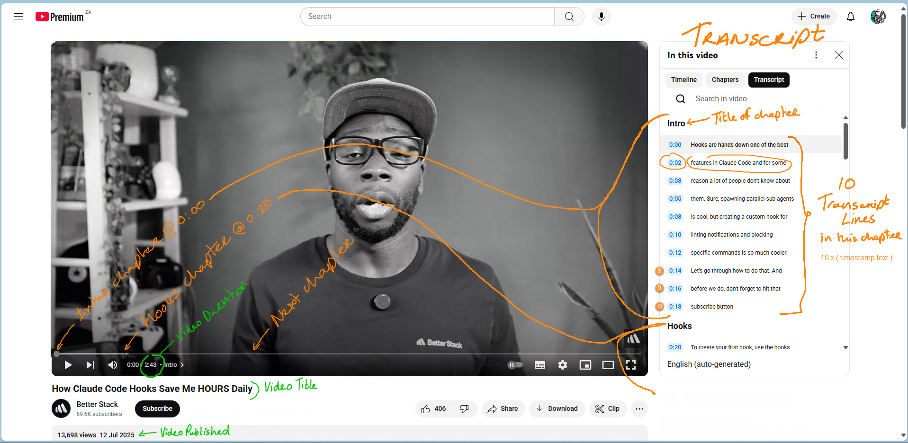

# YouTube Terminology Guide for youtube-to-xml

## Overview: Chosen Terminology

Since people interact with YouTube's "Show transcript" button and this application processes text transcripts (whether downloaded internally via `yt-dlp` API or copy-paste into an input file), this application uses **TRANSCRIPT** terminology throughout. Here's why:

1. **User-facing clarity**: People see "Show transcript" on YouTube
2. **Describes the content**: It's literally a transcript of spoken words
3. **Avoids YouTube nuances**: People can see lines in a transcript, "subtitles" introduces an unnecessary word
4. **Source-agnostic**: Once parsed, it doesn't matter if it came from `yt-dlp` or copy-paste

## Core Concepts with Visual Example

When you click "Show Transcript" on YouTube, this is what you see:

<figure>
  <a href="images/terminology.youtube.jpg" target="_blank">
    
  </a>
  <figcaption>YouTube's transcript display format (click to enlarge)</figcaption>
</figure>

YouTube displays each transcript line as timestamp + text on one line (as shown in image above). But when copy-pasted, these get separated onto consecutive lines:

```text
Intro
0:00
Hooks are hands down one of the best
0:02
features in Claude Code and for some
0:03
reason a lot of people don't know about
0:05
them. Sure, spawning parallel sub agents
0:08
is cool, but creating a custom hook for
0:10
linting notifications and blocking
0:12
specific commands is so much cooler.
0:14
Let's go through how to do that. And
0:16
before we do, don't forget to hit that
0:18
subscribe button.
Hooks
0:20
To create your first hook, use the hooks
...
```

This contains:
- **Transcript**: The complete text (excerpt shown here)
- **Chapter Titles**: Section headers like "Intro" and "Hooks"
- **Transcript Lines**: Words spoken at a given point in time (each consists of a timestamp + text pair)
  - **Timestamp**: Time marker (e.g., "0:00")
  - **Text**: The spoken words (e.g., "Hooks are hands down one of the best")
- **Chapters**: Sections bounded by chapter titles, containing multiple transcript lines. These are optional on YouTube and created by the publisher.

**Example interpretation:** "This excerpt transcript contains two chapters. The Intro chapter has 10 transcript lines (from 0:00 to 0:18). The Hooks chapter begins with the transcript line at 0:20: 'To create your first hook, use the hooks'"

## Hierarchy

**Hierarchy**: Transcript → Chapters (optional) → Transcript Lines (timestamp + text)

## Data Flow Explanation

```text
YouTube Video
    ├── Via yt-dlp → Downloads subtitle file → Parsed as transcript lines
    └── Via Copy → User copies transcript text → Parsed as transcript lines
                            ↓
                   Unified Internal Model
                      (transcript_lines)
                            ↓
                        XML Output
```

Both sources provide the same data - timestamped text - just in different formats. The parsers (`scripts/url_to_transcript.py` and `file_parser.py`) convert these different formats into the same internal structure.

## Summary

While `yt-dlp` uses "subtitle" in its commands, what you're actually processing is **transcript data** - the textual representation of speech. Whether it comes from:
- A subtitle file (technical format from `yt-dlp`)
- The transcript panel (user-facing display on YouTube)

...it's all transcript data once parsed. Using "transcript" terminology makes your code more intuitive and aligns with what users understand.

Therefore, source agnostic **TRANSCRIPT** terminology has been used throughout to align to what people see for themselves on YouTube.